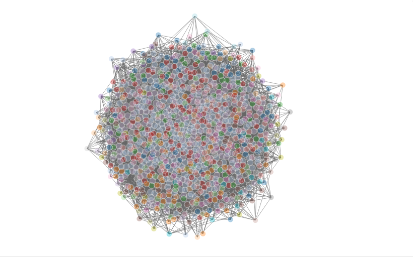

```{r setup, include=FALSE}
knitr::opts_chunk$set(echo = TRUE)
library(igraph)
library(networkD3)
library(dplyr)
library(magrittr)
library(fGarch)
library(ggplot2)
library(grid)
library(gridExtra)
```


# It's Controversial

# Intro
The following is part of our final project for our Mathematical Models in Biology class. The class is a part of Duke's Focus program, which groups students into "clusters" that live together and take classes with a similar interdisciplinary focus. Our cluster, "What If?" focuses on classes related to understand the past and predict the future. This class specifically focuses on biological models, but as it turns out, the spread of information can be modeled similarly to the spread of disease (however ironic that is).     

In this project, we were tasked with creating an Agent Based Model (ABM) to model the spread of rumors on Twitter. An ABM is a program that creates a network to model interactions between agents. We created a network using R's igraph package where vertices represent Twitter users, and edges represent the connections between them.     

This specific file models the spread of highly controversial rumors. In our model, we are accounting for:      
    
1. Every Twitter user has a different opinion about the subject of a tweet. In our model, the stronger their opinion (in support of or against the tweet), the more likely it is they spread the rumor by retweeting or replying.     
    
2. A Twitter user's opinion changes slightly to reflect the opinions of people who they follow. In our model, every user's opinion is changed slightly depending on what other people in their network tweet.     
    
3. We run the rumor for 24 iterations of rumor spreading, equivalent to 24 hours.


Below are a series of functions that we wrote to streamline the logic of our program.    
```{r}
createGraph = function(nodes = 10, distribution, distPressure){
  eg = make_empty_graph(nodes) %>%
    set_vertex_attr("knownState",V(.), FALSE) 
  for (i in 1:length(V(eg))){
    #print(sample(distribution$col,1))
    eg = set_vertex_attr(eg, "support", i, sample(distribution$col,1))
    eg = set_vertex_attr(eg, "pressure", i, sample(distPressure$col,1))
  }
  return(eg)
}

# Create a number of edges stemming from a given node 
createEdges = function(g, nodeIndex, numConnections){
  numNodes = length(V(g))
  if (numNodes<numConnections){
    stop("More connections than nodes!")
  }
  toConn = matrix(sample.int(numNodes, size = numConnections, replace = FALSE))
  addConnMat = c(rep(nodeIndex,numConnections*2))
  for (i in 1:numConnections){
    addConnMat[2*i] = toConn[i]
  }
  g = add_edges(g, addConnMat ) 
}

# Sets a node to be "known" and changes the fill color
becomeKnown = function(g, nodeIndex){
  g = set_vertex_attr(g,"knownState",nodeIndex, TRUE)
  return(g)
}


# Plots graphs as we wish
plotGraph = function (g){
  plot(g, edge.arrow.size=.5, vertex.label.color="black", vertex.label.dist=1)
}
```

```{r}
#Parameters
people = 1000   #Number of people in the network
avgCon = 10     #Average number of followers on twitter
sdCon = 5       #Standard deviation of followers on twitter
trigger = 1     
runTime = 24
supMean = 0.15
supSD = 0.1

distSupport = data.frame(col = c(rsnorm(1000, supMean, supSD),rsnorm(1000, -supMean, supSD)))
distPressure = data.frame(col = rsnorm(1000, mean = 0, sd = .1))

distConnection = data.frame(col = round(rsnorm(1000, mean = avgCon, sd = sdCon, xi = 20)))
g1 = ggplot(distConnection, aes(x=col)) + geom_histogram() + xlab("Number of Connections") +   ggtitle("Distribution of Number of Connections")
g2 = ggplot(distPressure, aes(x=col)) + geom_histogram() + ggtitle ("Distribution of Pressure Factors") +xlab("Peer Pressure")
g3 = ggplot(distSupport, aes(x = col)) + geom_histogram() + ggtitle("Distribution of Support") + xlab("Support")
grid.arrange(g1,g2,g3,ncol = 2)

```

Above are the graphs for the three parameters in our model.     

1. Every vertex has an initial opinion about the rumor, and its opinion is randomly assigned as a numeric value selected from the "Distribution of Support" graph.    
    
2. Every vertex's opinion changes slightly according to what they have heard from other people. But in real life, some people are more stubborn than others. To account for that, our model assigns us an "Ability to Pressured" factor to each vertex via the Distribution of Pressure graph. Each vertex is randomly assigned a value from that graph, and the closer the value is to 0, the more "stubborn" that vertex is.    
    
3. Every vertex is connected to number of nodes, n, where n is a randomly selected value from the distribution graphed in "Distribution of Number of Connections." The right skew of this distribution mimics the structure of Twitter where most people have hundreds of followers, but some celebrities have thousands or millions.     
    
Since we are graphing a controversial rumor, we have made our support distribution bimodal - to represent two sides of an argument that both have semi-strong opinions about the subject. This is applicable to many real life scenarios, like the 2016 election that divided the USA.     


```{r}

graphObj = createGraph(30,distSupport,distPressure)
for (i in 1:length(V(graphObj))){
  graphObj = createEdges(graphObj,i,5)
}

wc <- cluster_walktrap(graphObj)
members <- membership(wc)
graphObj_d3 = igraph_to_networkD3(graphObj, group = members)
forceNetwork(Links = graphObj_d3$links, Nodes = graphObj_d3$nodes,
             Source = 'source', Target = 'target',
             NodeID = 'name', Group = 'group')
```

Above is a representation of a small network of 30 nodes that each have 5 connections visualized in networkD3. We make it to show you what a networkd3 visualization would look like in its fully interactive form.



Above is an image of how networkD3 visualizes our network. It is 1000 nodes total and every node is randomly connected to a number of nodes n, where n is randomly selected from a heavily right skewed distribution with a mean of 10 to model how most individuals on Twitter have a few followers, but some, like celebrities, can be connceted to far more. This is only an image because loading networkd3's javascript for a network of this size would cause the entire webpage to lag.


```{r}
gr = createGraph(people,distSupport,distPressure)
for (i in 1:length(V(gr))){
  gr = createEdges(gr,i,sample(distConnection$col,1))
}
attr1 = get.vertex.attribute(gr,index = V(gr))
allData = data.frame(t = 1:runTime, numUnk= c(rep(NA,runTime)), numKnown = c(rep(NA,runTime)), avgSupport = c(rep(NA,runTime)), numSpreader=c(rep(NA,runTime)))


```


```{r}

fireNode = ceiling(runif(1,0,people))
for (time in 1:runTime){
  fireNodeNext={}
  for (nodeIndex in fireNode){
    #print(fireNode)
    neighborNodes = neighbors(gr,nodeIndex)
    #print(neighborNodes)
    gr = set.vertex.attribute(gr,"knownState",index=neighborNodes,TRUE)
    for (neighbor in neighborNodes){
      rand = runif(1,0,1)
      #print(sprintf('%5.3f, %5.3f',abs(get.vertex.attribute(gr, "support" ,neighbor)),rand))
      if (rand<abs(get.vertex.attribute(gr, "support" ,neighbor))){
        curNodeSupport = get.vertex.attribute(gr,"support",nodeIndex)
        curNeighborSupprot = get.vertex.attribute(gr,"support", neighbor)
        pressure = get.vertex.attribute(gr,"pressure", neighbor)
        gr = set.vertex.attribute(gr,"support",neighbor,curNeighborSupprot+curNodeSupport*abs(pressure))
        if (sum(grepl(neighbor, fireNodeNext)==TRUE)==0){
          fireNodeNext = c(fireNodeNext, neighbor)
          #print(fireNodeNext)
        }
        
      }
    }
    #print(fireNodeNext)
  }
  attr = get.vertex.attribute(gr,index = V(gr))
  allData$t[time] = time
  allData$numUnk[time] = sum(attr$knownState==FALSE)
  allData$numKnown [time]= people-allData$numUnk[time]
  allData$numSpreader[time] = length(fireNode)
  allData$avgSupport[time] = mean(get.vertex.attribute(gr,"support",V(gr)))
  sumPos = 0
  sumNeg = 0
  totPos = 0
  totNeg = 0
  for (i in attr$support){
    if (i>0){
      sumPos = sumPos+i
      totPos = totPos + 1
    }
    else if (i<0){
      sumNeg = sumNeg + i
      totNeg = totNeg + 1 
    }
  }
  allData$avgPosSupport[time] = sumPos/totPos
  allData$avgNegSupport[time] = sumNeg/totNeg
  allData$nonNeutral[time] = mean(abs(get.vertex.attribute(gr,"support",V(gr))))
  fireNode = fireNodeNext%>%unique()
  
}

```

```{r}
g1 = ggplot(allData,(aes(x=t))) +
geom_line(aes(y=numKnown, color = "Known"), size=1, alpha=0.75) +
  geom_line(aes(y=numUnk, color = "Unknown"), size=1, alpha=0.75) + 
  ggtitle("Knowledge of Rumor")

g2 = ggplot(allData,aes(x=t)) + 
  geom_line(aes(y=numSpreader), size = 1, alpha = 0.75) +
  ggtitle("Number of Spreaders")

g3 = ggplot(allData,(aes(x=t))) +
geom_line(aes(y=avgSupport), size=1, alpha=0.75) +
  ggtitle("Overall Support")

g4 = ggplot(allData,(aes(x=t))) +
geom_line(aes(y=nonNeutral), size=1, alpha=0.75) +
  ggtitle("Polarization")

g5 = ggplot(allData,(aes(x=t))) +
  geom_line(aes(y=avgPosSupport, color = "Positive"), size=1, alpha=0.75) + 
  ggtitle("Positive Support")
  
g6 = ggplot(allData,(aes(x=t))) +
  geom_line(aes(y=avgNegSupport, color = "Negative"), size=1, alpha=0.75) +
  ggtitle("Negative Support")


grid.arrange(g1,g2,g3,g4,g5,g6, ncol=2)
```


We ran our program with varying initial support distribution corresponding to different types of rumors, and plotted several variables, whose graphs that served as our results. On every graph, the x-axis is “t” for time, in hours. The y-variables change from graph to graph: below, we list each graph in the panel and state what is being plotted.     

o	Knowledge of Rumor – This graphs how many people are aware of the rumor at any given time. Two lines are plotted to show how many know and don’t know.     
    
o	Number of Spreaders – How many vertices in our network are experiencing spreading events in our network at the end of the round. This corresponds to how many people are spreading the rumor at the end of each hour.   
    
o	Overall Support – Graphs the average of every vertex’s support variable. This corresponds to the network’s overall support for the rumor.    
    
o	Polarization – Graphs the average of the absolute value of every vertex’s support variable. This corresponds to how strong of an opinion every vertex has about the rumor. The farther this value is from 0, the stronger of an opinion every vertex has.          
    
o	Positive Support – Graphs the average support for every vertex that has a positive support value. This models the strength of opinion for those who are in support of the rumor.        
    
o	Negative Support – Same as positive support, but graphs the average for all vertices with a negative support value.
      
    
Applying the model to the American election, the model seems unfortunately accurate. The positive leaning population becomes more positive as time goes on in this rumor, and the negative side also becomes more negative. The overall opinion of society, however, does not change. It zig-zags around 0, but never meaningfully increases in any single direction. Thus, society becomes more and more divided with no resolution to their conflict.    
    
Another interesting observation of this model is the number of spreaders and rate at which people become aware of the rumor.  We ran this model for a rumor that society generally had strong positive opinions about. In that scenario, everyone knew about the rumor in 24 hours and there were around 80 spreaders after 24 hours. In this case, nearly everyone knows about the rumor in 10-15 hours and the number of spreaders at the end of the 24 hour period is in the range 300-400. Thus, we can conclude from our model that controversial rumors spread much faster and more destructively (because of polarization) than rumors that most people can agree on.

